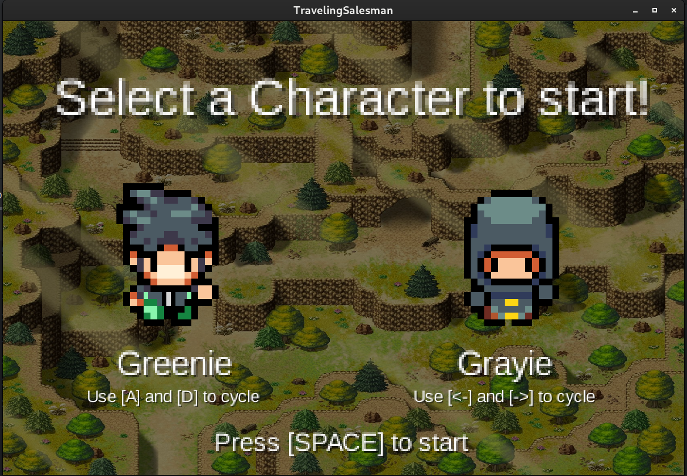
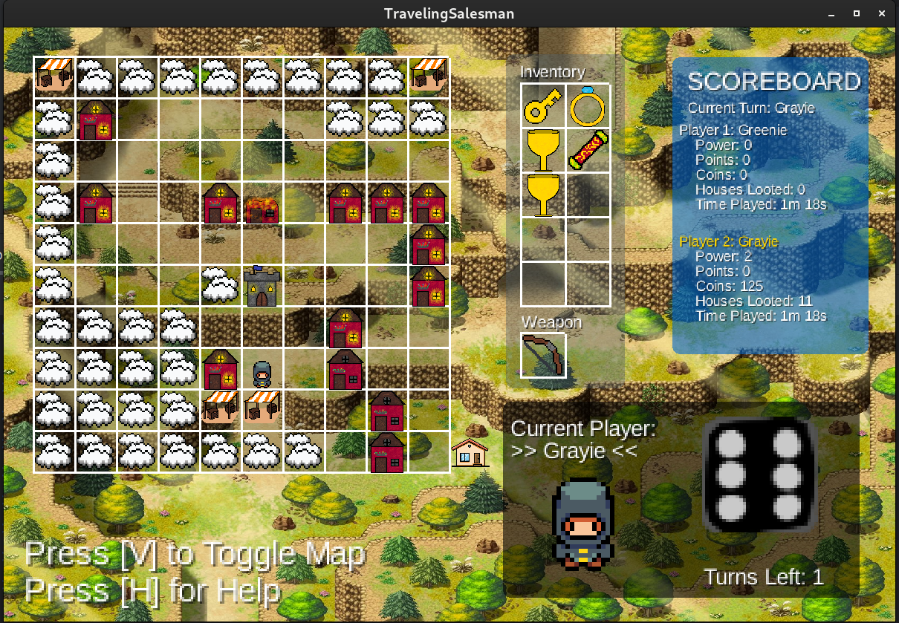
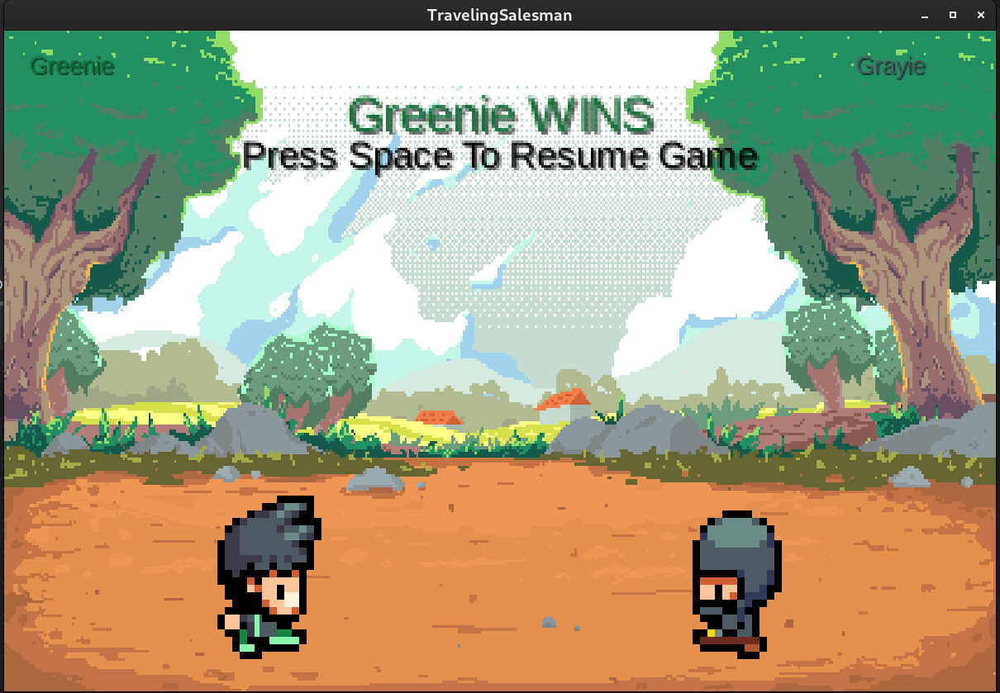
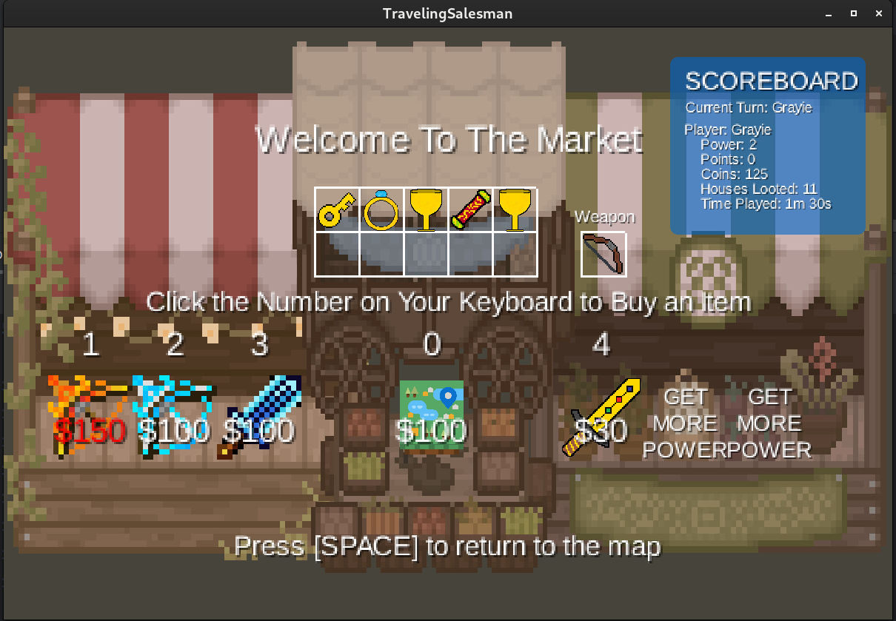
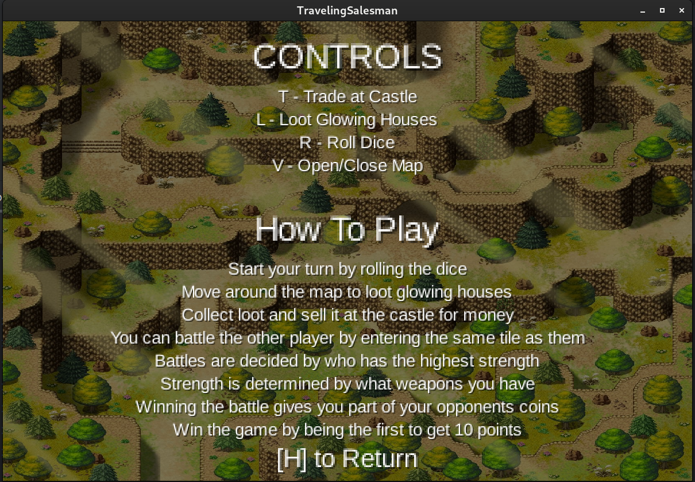

# Traveling Salesman

This is a group project for the course "ENGG*1420 - Object-Oriented Programming" at the University of Guelph. This project is worth 20% of the overall grade for the course. Our team was made up of the following five members:

- Jonathan Butterworth
- Kavin Manaperi
- Seth deVeries
- Mark de Lima
- Emile (Christian) Azzam

Together, we all earned exactly 100% on this project. It was a really fun and rewarding experience. The project was completed in the Winter 2024 semester. 

# Project Description

Our task was to create a game based on a vague outline provided by the course instructor. 
The game is a 2D, two player game that is played on a 10-by-10 map. 
The game is a turn-based strategy game where players take turns moving their pieces around the map. 
The goal of the game is to collect as many points as possible by collecting coins and treasures hidden around the map, and then trading them in for points at a castle at the center of the map.
Player also have to avoid trapped houses that will take away points from the player, as well as the other player who can steal points from you by landing on the same square as you, engaging in a battle.
below is a list of **some** features that we were required to implemented in the game:

### Markets
Players can enter markets to buy weapons. Different weapons have different amounts of power, and power is used to determine the outcome of battles. Every time a player enters a market a list of up to six random weapons will be offered to the player.

### Battles
If a player lands on the same square as another player, they will enter a battle. Whoever wins the battle will get to stay on the same square, however the loseing player will lose coins, and also have to move back to the start square.

### Trapped Houses
If a player lands a a trapped house, they can choose to loose either coins our points. After a player has landed on a trapped house, it becomes "burned", and players will no longer be able to move through that square on the map.

### Loot / Treasure Houses
There are many loot and treasure houses scattered around the map. If you land on them you can loot them to receive either coins, or a treasure item. After a house has been looted, it will become an "empty" house. After a while it will restock and become loot able again.

### Loot Items
Loot items can be traded in at the castle for points. The more loot items you have, the more points you will receive. Loot items are found it treasure houses.

### Castle
The castle is located at the center of the map. Players can trade in their loot items for points at the castle. The player with the most points at the end of the game wins.

### Roll Panel
The roll panel is always visible during the game. It disables the dice, and notifies the player when they can roll.

### Scoreboard
The scoreboard is always visible suring the game. It siplayers important information such as how many coins, points, and power each player has. It also tracks the players play time, and displays whose turn it currently is.

### Help Menu
The Help manu can be opened by pressing the "H" key. It displays a breif summary of the how the game works as well as some basic controls.

### Game Setup Scene
This Scene is actually not required by the outline. It is displayed before a game, and allows players to choose which sprite they want to play as. Both players cannot choose the same sprite.

# How was it made?
This implementation of traveling salesman was made using the java based LibGDX framework. LibGDX is a cross-platform game development framework that allows for the development of games for desktop, Android, and iOS. The game was developed using the IntelliJ IDEA IDE, and the project was managed using Git and GitHub. Our implementation only supports desktop use.

# How to run the game
Clone the project, then run gradle build command, finally run gradle run command. That's it! Note you must be using at least Java 17.

# Screenshots

### Character Selection

### Mid Game View

### Battle Scene

### Market Scene

### Help Menu

