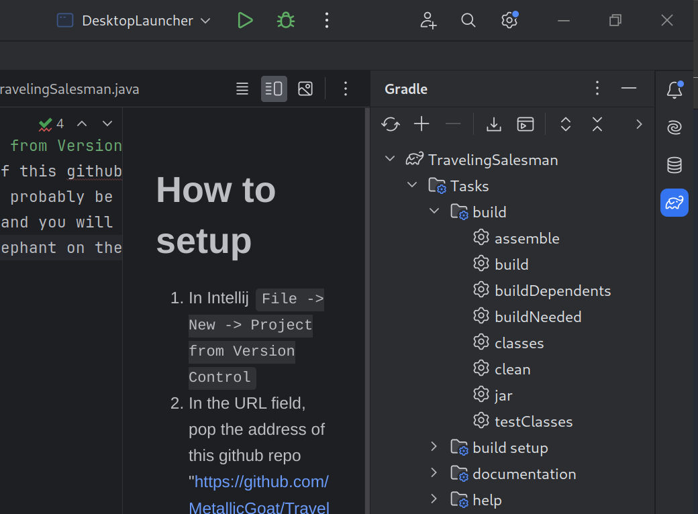

# Run da project
1. In Intellij `File -> New -> Project from Version Control`
2. In the URL field, pop the address of this github repo "https://github.com/MetallicGoat/TravelingSalesman"
3. This is a private repo, so you will probably be promted to connect your GitHub account with Intellij if you have not already
4. Intellij should clone the project, and you will be prompted to setup an SDK (LibGDX recommends Java 11 to 18, I recommend using Java 17)
5. You should see the little gradle elephant on the bar to the right, click on it.

6. Try clicking the build option, and make sure it runs with no errors
7. Open up the desktop folder, and find the DesktopLauncher class. Try to run that.
8. Make sure you get this little guy here at the top after you successfully run it

# Da project structure
All the game logic should go in the core directory. 
The desktop directory is only used for launching the game, setting up the game window itself etc... Mainly ignore it

# Important!!
1. If you are working on a branch with someone else, always pull shit before you push shit :)
2. Comments with curse words are funny
